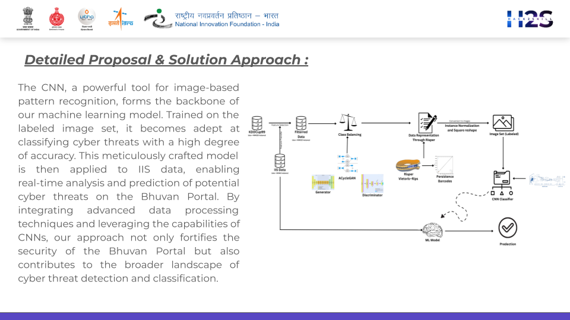

# We Showed Up: Securing Sensitive Geospatial Data on Bhuvan Portal

## Overview
This project aims to develop a comprehensive model for proactive detection and classification of cyber threats, ensuring the security and integrity of sensitive geospatial data on the Bhuvan Portal. Leveraging machine learning and topological data analysis techniques, our approach enhances threat detection capabilities using advanced data processing methodologies.

## Problem Statement
The objective is to address cybersecurity challenges associated with the Bhuvan Portal, focusing on the protection of sensitive geospatial data from cyber threats.

## Approach
1. **Data Preparation using KDDCup99 Dataset**
   - We started with the KDDCup99 dataset, a widely used benchmark for cybersecurity research.
   - Implemented meticulous filtering and balancing using AcycleGan to enhance dataset quality and balance class distributions.

2. **Topological Data Representation with RISPER**
   - Applied RISPER to extract persistence barcodes, capturing complex patterns in cyber-attack sequences.
   - Transformed data into a labeled image set through instance normalization and reshaping.

3. **Machine Learning Model**
   - Developed a Convolutional Neural Network (CNN) classifier using PyTorch.
   - Trained the CNN on the labeled image set to classify cyber threats with high accuracy.

4. **Integration and Application**
   - Applied the trained model to real-time data from IIS, enabling proactive analysis and prediction of cyber threats on the Bhuvan Portal.

## Proposed Solution

## Tools and Technologies
- **Tools**: PyTorch, Ripser, Mapper
- **Technologies**: Topological Data Analysis, ACycleGAN, CNN

## Impact
This project not only strengthens the security of the Bhuvan Portal against cyber threats but also contributes to advancing the field of cyber threat detection and classification through innovative use of machine learning and topological data analysis techniques.

## Members
- Tirth Joshi
- Anisha Katiyar
- Prathak Garg
